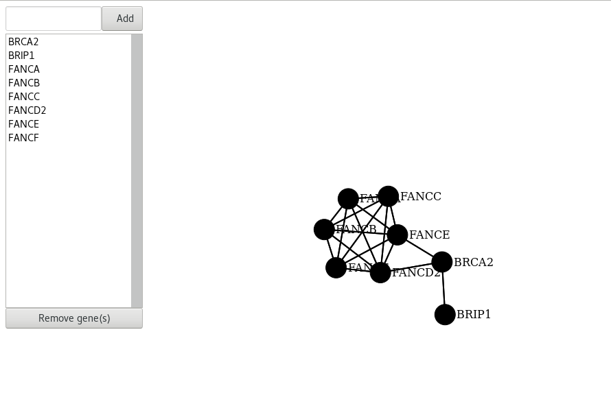

# D3 force layout network example with a protein-protein interaction network

This example renders protein-protein relationships from STRING v10.

Check it out [here](https://rawgit.com/kcanderson/d3ForceNetworkExample/master/index.html).

## Screenshot

